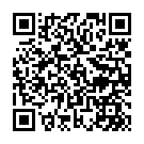

<h1>Western Music Recommender Line Bot</h1>
for the final project of the class, High Speed Computing and Data Processing

* * *

<h2>Contents</h2>

* [Purpose](#purpose)
* [Data Source](#data_source)
* [Framework](#framework)
  * [Undone](#framework_undone)
* [QRCode](#qr_code)
* [Appreciation](#appreciation)

* * *

<h2 id="purpose">Purpose</h2>

Provides user a convenience line bot to access the top rank music.

* * *

<h2 id="data_source">Data Source</h2>

The famous music ranking website: [Billboard Hot 100][billboard_hot_100].

  [billboard_hot_100]: https://www.billboard.com/charts/hot-100

* * *

<h2 id="framework">Framework</h2>

* Help: shows all instructions
* Help [Instruction]: shows the description of the specified instruction
* TopSong: shows the top 10 songs of the rank this week
* Listen TopSong [Rank Order]: gives the link of the YouTube search by the rank order of the top songs

<h3 id="framework_undone">Undone</h3>
The instructions below are still in the process.

* BestCreator: shows the top 10 popular creators of the rank this week
* Like: records the user personal likes to give the more suitable rank list
* Report: reports the bugs to us
* Suggest: gives the suggest of the issues to us

* * *

<h2 id="qr_code">QRCode</h2>

  

* * *

<h2 id="appreciation">Appreciation</h2>

I appreciate the great course of [Professor Addison Su (蘇育生教授)][addison_su]. The contents are useful and practical and help me a lot.

  [addison_su]: http://bigrlab.herokuapp.com/

* * *
